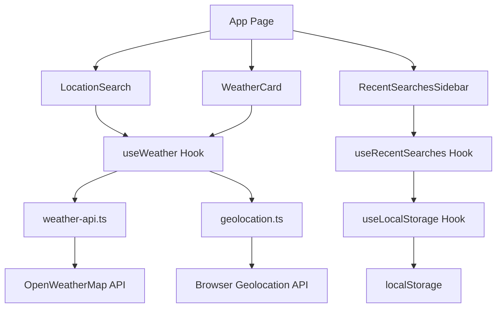

<div align="center">


# Wetho


[](https://wetho.netlify.app)
[](https://github.com/deepto98/weather-app)
[](https://lighthouse-metrics.com/lighthouse/checks/4c28c1f1-8809-4826-9f17-efbb29f6db35)
[](https://securityheaders.com/?q=https%3A%2F%2Fwetho.netlify.app%2F&followRedirects=on)

**Real-time weather data with air quality monitoring and intelligent location search**

[📱 **Live Demo**](https://wetho.netlify.app) • [📊 **Performance**](https://pagespeed.web.dev/analysis/https-wetho-netlify-app/2rgmsi3tr8) • [🔒 **Security Report**](https://securityheaders.com/?q=https%3A%2F%2Fwetho.netlify.app%2F&followRedirects=on)

</div>

---
  
## Table of Contents
1. [Overview](#overview)
2. [Project Architecture](#Project-architecture)
3. [Features](#features)
4. [Components](#components)
5. [Hooks](#hooks)
6. [API Integration](#api-integration)
7. [Performance and SEO Optimizations](#performance-optimizations)
8. [Security Implementation](#Security-Implementation)
9. [Testing and Coverage](#testing-and-coverage)
10. [Deployment](#deployment)
11. [Performance and Security Monitoring](#performance-and-security-monitoring)

## Overview

Wetho is a weather application built with Next.js 15, TypeScript, Tailwind CSS and the OpenWeatherMap API. It provides real-time weather data, air quality information, and a history of places searched for.  
 
## Project Architecture

### Project Structure
```
├── app/                          # Next.js App Router
│   ├── layout.tsx               # Root layout with SEO & PWA config
│   └── page.tsx                 # Main application page
├── components/                   # UI Components
│   ├── WeatherCard.tsx          # Main weather display component
│   ├── LocationSearch.tsx       # Search input with autocomplete
│   ├── RecentSearchesSidebar.tsx # Collapsible search history
│   ├── LoadingWeather.tsx       # Skeleton loading UI
│   └── ErrorMessage.tsx         # Error handling component
├── hooks/                        # Custom React Hooks
│   ├── useWeather.ts            # Weather data management
│   ├── useRecentSearches.ts     # Search history management
│   └── useLocalStorage.ts       # SSR-safe localStorage hook
├── lib/                          # Utilities & API
│   ├── types.ts                 # TypeScript definitions
│   ├── weather-api.ts           # OpenWeatherMap API integration
│   └── geolocation.ts           # Browser geolocation utilities
├── public/                       # Static assets
│   ├── favicon.svg              # App favicon
│   ├── apple-touch-icon.png     # PWA icon
│   └── manifest.json            # Web app manifest
├── __tests__/                    # Test files
│   ├── components/              # Component tests
│   └── hooks/                   # Hook tests
├── next.config.ts               # Next.js configuration
├── jest.config.ts               # Jest configuration
└── jest.setup.ts                # Jest setup & mocks
```

### Communication Pattern


 
---
 
## Features

### Core Features
- **Real-time Weather Data**: Temperature, humidity, wind, visibility, pressure
- **Air Quality Index**: Comprehensive AQI with pollutant levels (PM2.5, PM10, CO, NO₂, O₃, SO₂)
- **Intelligent Location Search**: Debounced autocomplete with geolocation fallback
- **Smart Search History**: Persistent, deduplicating recent searches with frequency tracking
  
### Advanced Features
- **GPS Integration**: Automatic location detection with privacy-conscious fallbacks
- **Search Deduplication**: Smart merging of duplicate locations with search count tracking
- **Hydration-safe Storage**: SSR-compatible localStorage with race condition handling
 - **Accessibility**: Full keyboard navigation, screen reader support, proper ARIA labels
 
 
## Components

### 1. WeatherCard.tsx
**Purpose**: Main weather display component with comprehensive weather information.

**Key Features**:
- Weather icon mapping for 50+ weather conditions
- AQI visualization with interactive chart
 - Memoized for performance (`React.memo`)

**Props**:
```typescript
interface WeatherCardProps {
  data: WeatherData;
}
```

**Performance Optimizations**:
- `useMemo` for expensive weather icon calculations
- `React.memo` to prevent unnecessary re-renders
- Optimized conditional rendering

### 2. LocationSearch.tsx
**Purpose**: Search input with real-time autocomplete and geolocation integration.

 

**State Management**:
```typescript
const [query, setQuery] = useState('');
const [suggestions, setSuggestions] = useState<Location[]>([]);
const [isLoading, setIsLoading] = useState(false);
const [showSuggestions, setShowSuggestions] = useState(false);
```

### 3. RecentSearchesSidebar.tsx
**Purpose**: Collapsible sidebar managing persistent search history.

**Key Features**:
- Responsive behavior (collapsed on mobile, open on desktop)
- Search frequency visualization
 

 

## Hooks

### 1. useWeather.ts
**Purpose**: Central weather data management with intelligent caching and refresh logic.

**Key Features**:
- Smart auto-refresh using Page Visibility API
- Request cancellation with AbortController
- Stale data detection and indicators
- GPS location handling with fallbacks

**State Management**:
```typescript
interface UseWeatherState {
  data: WeatherData | null;
  loading: boolean;
  error: string | null;
  lastUpdated: Date | null;
}
```

**Performance Features**:
- 10-minute cache duration with 5-minute stale threshold
- Background refresh when page becomes visible
- Request deduplication to prevent concurrent API calls

### 2. useRecentSearches.ts
**Purpose**: Manages persistent search history with intelligent deduplication.

**Core Algorithm**:
```typescript
// Smart deduplication logic
if (existingIndex >= 0) {
  // Move to top, increment count, update timestamp
  updatedSearches = [
    { ...existingSearch, timestamp: Date.now(), searchCount: existingSearch.searchCount + 1 },
    ...prev.filter((_, index) => index !== existingIndex)
  ];
} else {
  // Add new search at top, limit to 10
  updatedSearches = [newSearch, ...prev].slice(0, 10);
}
```

**Hydration Safety**:
- Pending search queue for pre-hydration additions
- Race condition prevention with setTimeout scheduling
- SSR mismatch prevention with hydration checks

### 3. useLocalStorage.ts
**Purpose**: SSR-safe localStorage integration with hydration management.

**Key Features**:
- Prevents hydration mismatches
- Graceful error handling for storage API failures
- Type-safe generic implementation

**Hydration Pattern**:
```typescript
const [isHydrated, setIsHydrated] = useState(false);

useEffect(() => {
  // Only access localStorage after client-side hydration
  try {
    const item = window.localStorage.getItem(key);
    if (item) setStoredValue(JSON.parse(item));
  } catch (error) {
    console.error('localStorage error:', error);
  }
  setIsHydrated(true);
}, [key]);
```

## API Integration

### 1. OpenWeatherMap API  
**Base URL**: `https://api.openweathermap.org/data/2.5/`

**Endpoints Used**:
1. **Current Weather**: `/weather`
2. **Air Quality**: `/air_pollution`
3. **Geocoding**: `/geo/1.0/direct`
4. **Reverse Geocoding**: `/geo/1.0/reverse`

### 2. Geolocation Web API 
Used to fetch the device's coordinates, with a default fallback to New York's location, if GPS isn't enabled or available. 
 
 

## Performance Optimizations

### 1. Next.js Bundle Optimizations
```typescript
const nextConfig = {
  // Gzip compression for all assets
  compress: true,
  
  // Bundle optimization
  webpack: (config) => ({
    ...config,
    optimization: {
      usedExports: true,
      sideEffects: false,
    }
  }),
  
  // Package imports optimization
  experimental: {
    optimizePackageImports: ['lucide-react'],
  }
};
```

### 2. React Performance Optimizations
1. **Component Memoization**: `React.memo` for expensive components - WeatherCard.tsx 
```typescript
// React.memo for expensive components
const WeatherCard = React.memo<WeatherCardProps>(({ data }) => {
  // Memoized calculations
  const locationDisplay = useMemo(() => 
    formatLocationName(data.location), [data.location]
  )
  
  const aqiLevel = useMemo(() => 
    getAQILevel(data.air_quality.aqi), [data.air_quality.aqi]
  )

  return (
    <div className="bg-white rounded-xl shadow-lg p-6">
      {/* Weather display */}
    </div>
  )
})
 
```

2. **Hook Memoization**: `useMemo` and `useCallback` for computed values
3. **Code Splitting**: Dynamic imports for non-critical components
4. **Request Deduplication**: AbortController for canceling stale requests

### 3. Caching Strategy
```typescript
// Memory cache with TTL
const CACHE_DURATION = 10 * 60 * 1000; // 10 minutes
const STALE_DURATION = 5 * 60 * 1000;  // 5 minutes

// Smart refresh based on page visibility
document.addEventListener('visibilitychange', () => {
  if (!document.hidden && isDataStale()) {
    refreshWeatherData();
  }
});
```

 

### 4. SEO Optimizations

#### a. Meta Tags & SEO
```typescript
// app/layout.tsx
export const metadata: Metadata = {
  title: 'Wetho - Weather App',
  description: 'Get real-time weather and air quality data',
  keywords: ['weather', 'forecast', 'air quality', 'AQI'],
  openGraph: {
    title: 'Wetho Weather App',
    description: 'Real-time weather and air quality information',
    type: 'website',
  },
  robots: 'index, follow',
};
```

#### b. Progressive Web App to improve SEO
```json
// public/manifest.json
{
  "name": "Wetho Weather App",
  "short_name": "Wetho",
  "theme_color": "#3B82F6",
  "background_color": "#EFF6FF",
  "display": "standalone",
  "start_url": "/",
  "icons": [
    {
      "src": "/apple-touch-icon.png",
      "sizes": "192x192",
      "type": "image/png"
    }
  ]
}
```

#### c. Font Optimization by preloading 
```typescript
// Preload critical fonts
<link
  rel="preload"
  href="/fonts/inter.woff2"
  as="font"
  type="font/woff2"
  crossOrigin="anonymous"
/>
```


## Security Implementation

### 1. Content Security Policy Headers
```typescript
// Production CSP headers
"Content-Security-Policy": [
  "default-src 'self'",
  "script-src 'self'",
  "style-src 'self' 'unsafe-inline'",
  "img-src 'self' data: https:",
  "connect-src 'self' https://api.openweathermap.org",
  "font-src 'self'",
].join('; ')
```

### 2. Other Security Headers
- **X-Frame-Options**: `DENY`
- **X-Content-Type-Options**: `nosniff`
- **Referrer-Policy**: `origin-when-cross-origin`
- **Strict-Transport-Security**: `max-age=31536000`
 

## Testing and Coverage

 
### Test Categories
The test suite comprises of 42 tests spanning all the major hooks and components
#### Component Tests
```typescript
// example : WeatherCard.test.tsx
describe('WeatherCard', () => {
  it('renders weather information correctly', () => {
    render(<WeatherCard data={mockWeatherData} />);
    expect(screen.getByText('22°')).toBeInTheDocument();
    expect(screen.getByText('Clear')).toBeInTheDocument();
  });
});
```

#### Hook Tests
```typescript
// example : useWeather.test.tsx
describe('useWeather', () => {
  it('handles GPS location fetching', async () => {
    const { result } = renderHook(() => useWeather());
    await waitFor(() => {
      expect(result.current.data).toBeTruthy();
    });
  });
});
```

### Mocking Strategy
- **API Calls**: Mocked with jest.mock()
- **Browser APIs**: Geolocation, localStorage mocked
- **Next.js**: Router and navigation mocked
- **Time**: Date.now() mocked for consistent tests

### Coverage Report
Summary :
* 48.72% Statements (859/1763)
* 81.14% Branches (99/122)
* 48.64% Functions (18/37)
* 48.72% Lines (859/1763)
 

File                        | % Stmts | % Branch | % Funcs | % Lines | Uncovered Line #s                
----------------------------|---------|----------|---------|---------|----------------------------------
All files                   |   48.72 |    81.14 |   48.64 |   48.72 |                                  
 app                        |       0 |        0 |       0 |       0 |                                  
  layout.tsx                |       0 |        0 |       0 |       0 | 1-153                            
  page.tsx                  |       0 |        0 |       0 |       0 | 1-168                            
 components                 |   84.09 |    80.89 |   77.27 |   84.09 |                                  
  ErrorMessage.tsx          |       0 |        0 |       0 |       0 | 1-30                             
  LoadingWeather.tsx        |       0 |        0 |       0 |       0 | 1-73                             
  LocationSearch.tsx        |   94.36 |    84.61 |     100 |   94.36 | 40-41,78-79,84-85,101-102        
  RecentSearchesSidebar.tsx |   97.95 |    81.08 |   66.66 |   97.95 | 137,178-180,212                  
  WeatherCard.tsx           |   97.84 |    83.33 |     100 |   97.84 | 130-135                          
 hooks                      |   46.07 |       90 |      20 |   46.07 |                                  
  useLocalStorage.ts        |     7.5 |      100 |       0 |     7.5 | 4-40                             
  useRecentSearches.ts      |    9.09 |      100 |       0 |    9.09 | 14-28,31-165                     
  useWeather.ts             |   89.26 |       90 |      50 |   89.26 | 93-94,99,117-118,126-131,140-147 
 lib                        |   12.96 |        0 |       0 |   12.96 |                                  
  geolocation.ts            |    17.1 |      100 |       0 |    17.1 | 10-57,60-67,70-76                
  types.ts                  |       0 |        0 |       0 |       0 | 1-46                             
  weather-api.ts            |   14.61 |      100 |       0 |   14.61 | 10-12,25-107,110-138,141-171     
----------------------------|---------|----------|---------|---------|----------------------------------

Test Suites: 4 passed, 4 total
Tests:       42 passed, 42 total
Snapshots:   0 total
Time:        6.514 s

To generate the report, run: `npm test -- --coverage --coverageDirectory='coverage'` and view the report at `coverage/lcov-report/index.html` 

## Deployment

### Production Build Process
```bash
# Build optimization
npm run build

# Output analysis
npm run analyze  # Bundle size analysis
npm run test     # Full test suite
npm run lint     # Code quality checks
```

### Environment Configuration
```bash
# Required environment variables
NEXT_PUBLIC_OPENWEATHER_API_KEY=your_api_key

# Optional configuration
NODE_ENV=production
```
 
## Performance and Security Monitoring
- **Lighthouse**:  https://lighthouse-metrics.com/lighthouse/checks/4c28c1f1-8809-4826-9f17-efbb29f6db35
- **Page Speed Insights**:  https://pagespeed.web.dev/analysis/https-wetho-netlify-app/2rgmsi3tr8
- **Securityheaders.com**:  https://securityheaders.com/?q=https%3A%2F%2Fwetho.netlify.app%2F&followRedirects=on
- **Immuniweb** : https://www.immuniweb.com/websec/wetho.netlify.app/IKuZJsWc/
- **Sssllabs** : https://www.ssllabs.com/ssltest/analyze.html?d=wetho.netlify.app
 